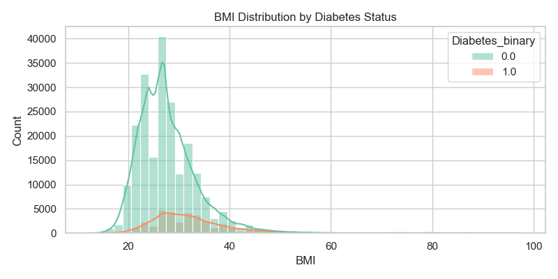
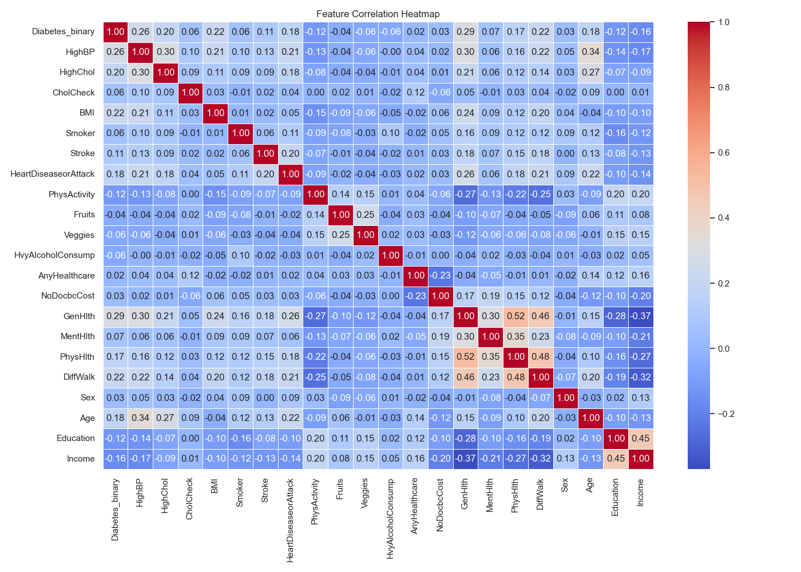
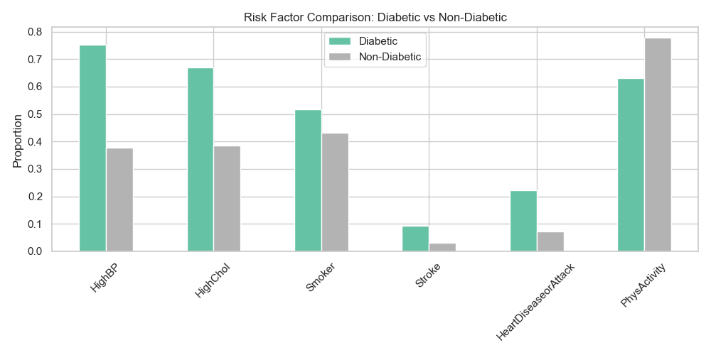
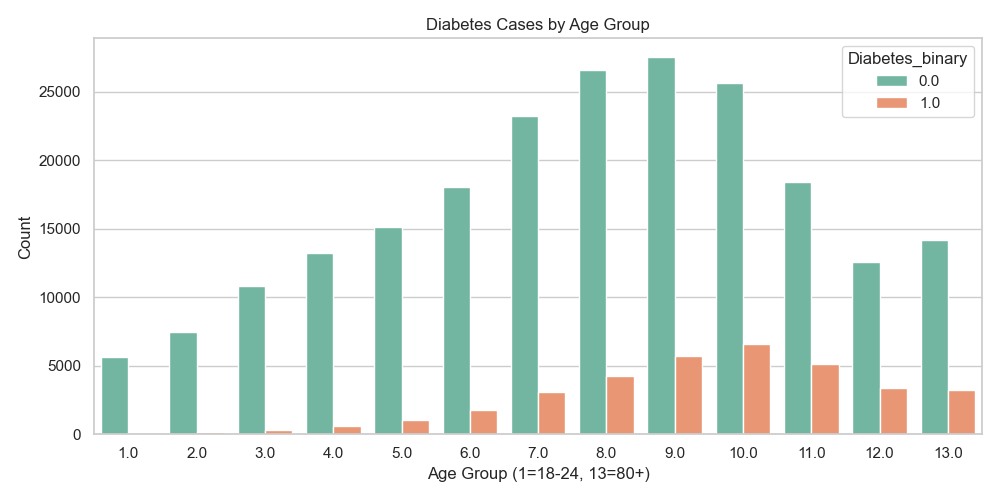
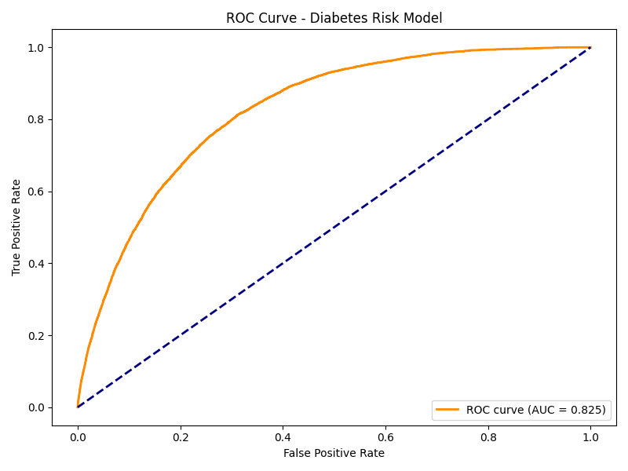
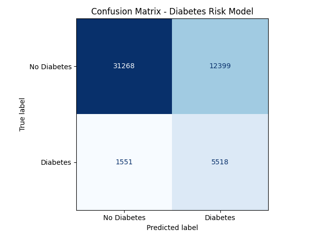
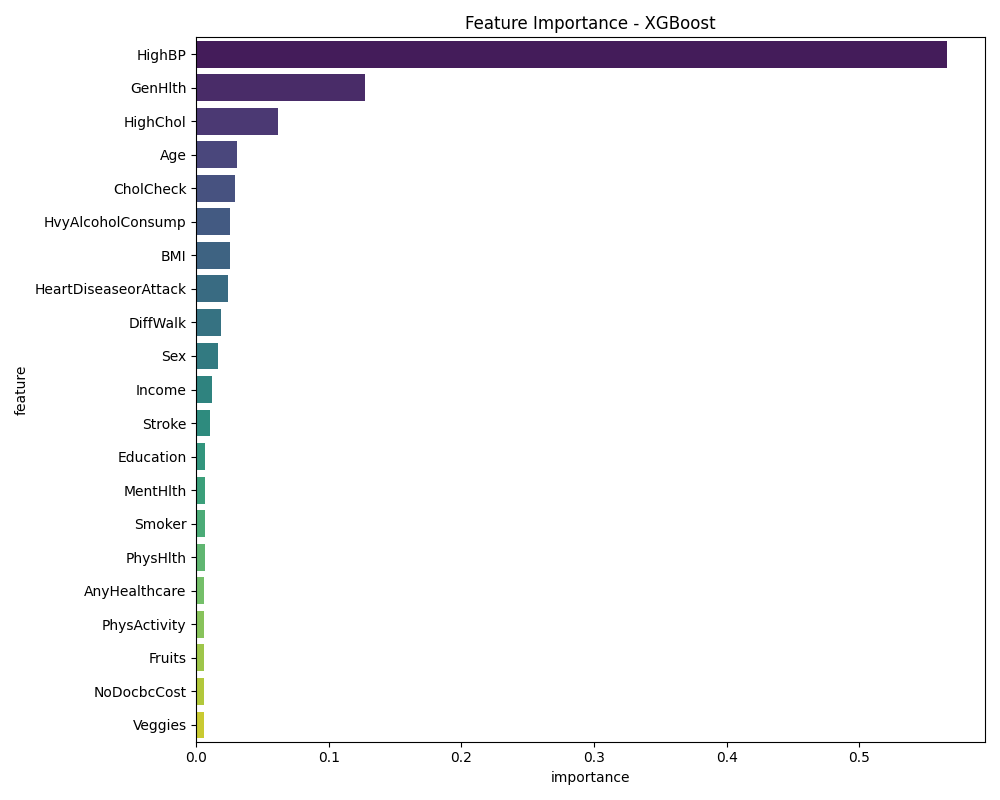
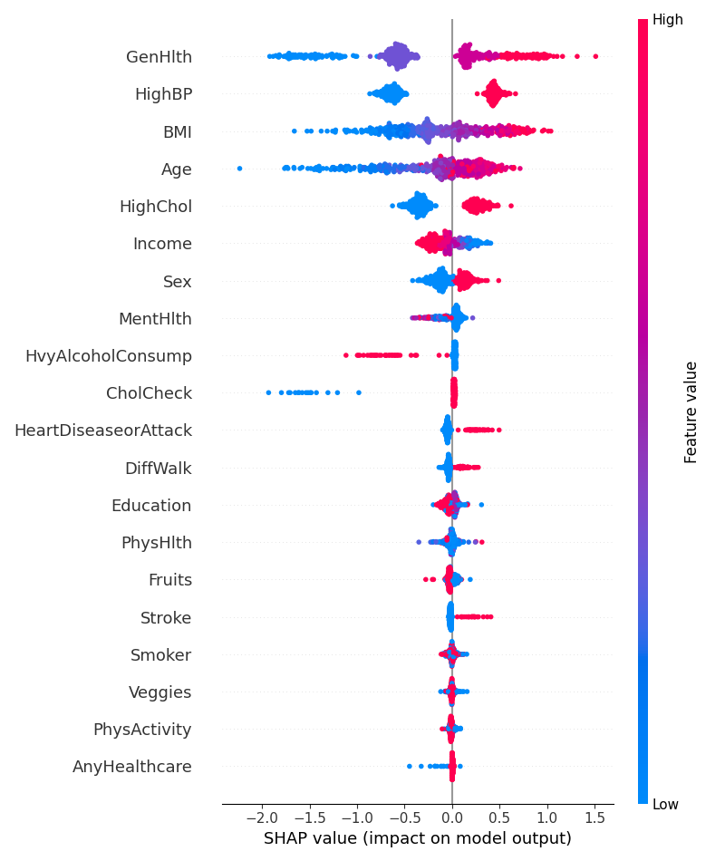

# Health Risk Prediction API

A production-ready Machine Learning API that predicts diabetes risk using the CDC BRFSS dataset (253,680 records). Built with XGBoost, FastAPI, MLflow, and deployed on AWS EC2.

---

## EDA Insights


### BMI Distribution


### Correlation Heatmap


### Risk Factors


### Age Distribution


---

## Model Performance

| Metric | Score |
|--------|-------|
| AUC | 0.825 |
| Accuracy | 72.5% |
| Recall | 78.1% |
| F1 Score | 0.44 |

### ROC Curve


### Confusion Matrix


### Feature Importance


### SHAP Summary


---

## Project Structure

```
health-risk-api/
├── app/                    ← FastAPI backend
│   ├── main.py
│   ├── auth.py
│   ├── schemas.py
│   ├── predict.py
│   └── database.py
├── training/               ← ML pipeline
│   ├── train.py
│   ├── evaluate.py
│   └── mlflow_logger.py
├── dashboard/              ← Streamlit frontend
│   └── streamlit_app.py
├── notebooks/              ← EDA + evaluation plots
│   └── eda.ipynb
├── images/                 ← All plots and charts
├── data/                   ← CDC BRFSS dataset
├── tests/                  ← API tests
├── Dockerfile
├── docker-compose.yml
└── requirements.txt
```

---

## Dataset

- **Source:** CDC Behavioral Risk Factor Surveillance System (BRFSS) 2015
- **Records:** 253,680 survey responses
- **Features:** 21 health indicators
- **Target:** Diabetes binary (0 = No Diabetes, 1 = Diabetes)

---

## Tech Stack

| Tool | Purpose |
|------|---------|
| XGBoost | ML model |
| FastAPI | REST API |
| MLflow | Experiment tracking |
| SHAP | Model explainability |
| Evidently | Data drift detection |
| Docker | Containerization |
| GitHub Actions | CI/CD pipeline |
| Streamlit | Dashboard |
| PostgreSQL | Database |
| AWS EC2 | Deployment |

---

## Key Features

- **B2B API** with API key authentication
- **Versioned endpoints** (`/v1/predict`, `/v2/predict`)
- **SHAP explanations** — every prediction comes with top risk factors
- **Data drift detection** — alerts when model needs retraining
- **CI/CD pipeline** — auto deploys on every git push
- **Live dashboard** — real-time predictions and model health

---

## Quick Start

### 1. Clone the repo
```bash
git clone https://github.com/amanchakrawarty2005/health-risk-api.git
cd health-risk-api
```

### 2. Create virtual environment
```bash
python -m venv venv
venv\Scripts\activate        # Windows
source venv/bin/activate     # Mac/Linux
```

### 3. Install dependencies
```bash
pip install -r requirements.txt
```

### 4. Train the model
```bash
python training/train.py
```

### 5. Start the API
```bash
uvicorn app.main:app --reload
```

---

## Author

**Aman Chakrawarty**
- GitHub: [@amanchakrawarty2005](https://github.com/amanchakrawarty2005)

---

*This README will be updated with live API URLs, architecture diagrams, and sample API calls after deployment in Phase 7.*